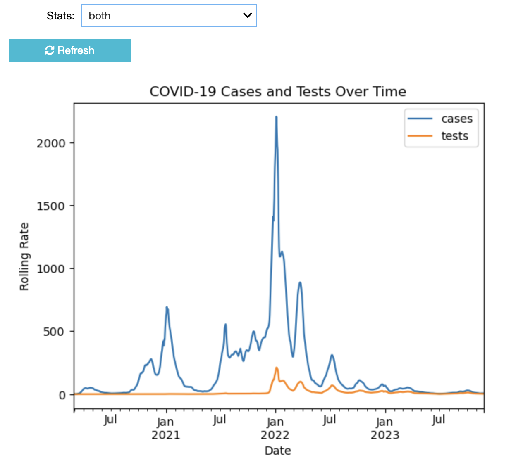
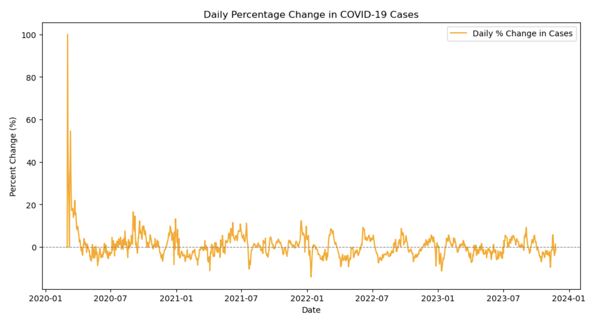
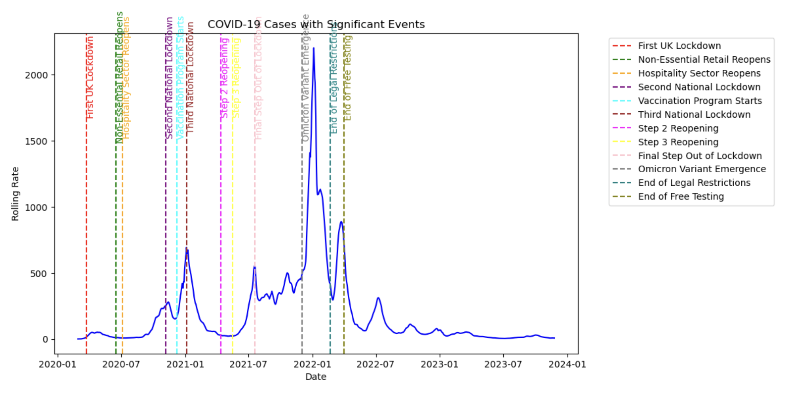

# covid-uk-dashboard
This project is a data analysis and visualization tool for tracking COVID-19 cases and reinfections in England. It leverages the UK COVID-19 API to fetch real-time data and provides insights through interactive visualizations.

### Project Overview 
The COVID-19 UK Dashboard focuses on analyzing key metrics, including new cases and reinfections. Using Python and Jupyter Notebook, the project provides a detailed analysis of the pandemic's trends and patterns in England.

**Core Functionality**

***Data Access***: Retrieves COVID-19 data directly from the UK COVID-19 API for England.

***Key Metrics***:
- Rolling rates of new cases.
- Rolling rates of reinfections.

***Visualization***: Provides charts and graphs to make the data more accessible.

---
### Installation and Usage 
***Prerequisites***
- Python 3.8+
- Jupyter Notebook or JupyterLab
- Libraries: `pandas`, `numpy`, `matplotlib`, `seaborn`, `uk_covid19`

***Steps***
1. Clone the repository:
   ```bash
   git clone https://github.com/adinanabi/covid-uk-dashboard.git
   cd covid-uk-dashboard
2. Open the notebook [UK COVID analysis](./uk_covid_analysis.ipynb) in Jupyter Notebook or JupyterLab.
3. The notebook fetches data from the UK COVID-19 API. If the API is unavailable, it will use the included [covid data](./timeseries.json) file as a fallback.

---
### Data Analysis
The notebook processes the fetched data to:
- Clean and transform it into a structured format (e.g., Pandas DataFrame).
- Generate visualizations for rolling rates of cases and reinfections.
- Highlight trends over time.

---
### Insights and Findings
#### Key Visualizations and Analysis
1. ***Time Series Analysis of COVID-19 Cases and Tests***
   


2. ***COVID-19 Case Statistics***

| Metric | Value |
| :--- | :--- |
| Total Cases |260,056 |
| Peak Daily Cases | 2,204 on 2022-01-04 |
| Current Daily Cases | 7 |
| Current 7-Day Average | 7.07 |

3. ***Daily Percentage Change in Cases***



4. ***Significant Events Impact on COVID-19 Cases***




#### Pandemic Trajectory Analysis
- **Initial Surge**: The data shows significant spikes in COVID-19 case rates during the early phases of the pandemic and winter months, likely due to increased transmission in colder weather and limited immunity. Notably, a substantial surge in cases occurred in January 2022, attributed to the emergence and rapid spread of the Omicron variant.
- **Vaccination Impact**: A steady decline in case rates is observable following the rollout of vaccination programs, reflecting their effectiveness in reducing severe outcomes and transmission.
- ***Lockdowns**: The implementation of multiple national lockdowns in the UK significantly contributed to reducing COVID-19 transmission rates by limiting social interactions and mobility, effectively breaking chains of virus transmission and helping to control the pandemic's spread.
- **Variant Challenges**: The emergence of new variants correlates with noticeable surges in cases, highlighting the importance of continuous monitoring and adapting public health responses.

#### Limitations and Considerations
- Data represents rolling rates and may not capture absolute case numbers
- Influenced by testing availability and reporting mechanisms
- Reflects specific context of England's pandemic response

---
### License
This project is for educational purposes and is licensed under the [GNU GPLv3.0 or later.](./LICENSE).


